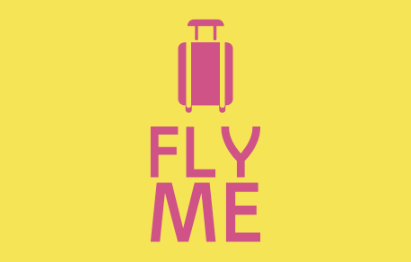

# Fly Me : flights booking chatbot



Goal : use **Azure Cognitive Services (LUIS)**, **Azure Web App** and **Azure Application Insights**, to build a flights booking chatbot, integrate it in a web application, and monitor its quality.

This is the project architecture:


## Goals

-   [x] Integrate model output into a finished product :
    -   Azure Language Understanding - LUIS: train and setup a dedicated language understanding model
    -   Azure App Service: deploy an interactive API
    -   Azure Bot: test the bot in a web chat
-   [x] Integrate an AI processing chain into an IT tool using a code version management tool :
    -   GitHub repository: manage the code
    -   Automated tests: test the bot
-   [x] Control the performance of the model in production
    -   Azure Application Insights: monitor the quality of the bot

---

## Install

```sh
conda create -n flyme python=3.8 -y
conda activate flyme
pip install -r requirements.txt
```