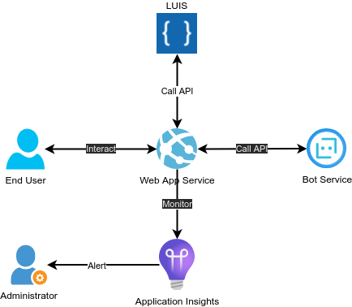

# Fly Me : flights booking chatbot

This is the project architecture in production :

Repository of OpenClassrooms' AI Engineer path, project #10 .

Goal : use **Azure Cognitive Services (LUIS)**, **Azure Web App** and **Azure Application Insights**, to build a flights booking chatbot, integrate it in a web application, and monitor its quality.

This is the project architecture:

## Goals

-   [x] Integrate model output into a finished product :
    -   [Azure Language Understanding - LUIS]("Azure Language Understanding - LUIS") : train and setup a dedicated language understanding model
    -   [Azure App Service]("Azure App Service") : deploy an interactive API
    -   [Azure Bot - Test in Web Chat]("Azure Bot - Test in Web Chat") : test the bot in a web chat
-   [x] Integrate an AI processing chain into an IT tool using a code version management tool :
    -   [GitHub repository]("GitHub repository") : manage the code
    -   [Automated tests]("Automated tests") : test the bot
-   [x] Control the performance of the model in production
    -   [Azure Application Insights]("Azure Application Insights") : monitor the quality of the bot

---